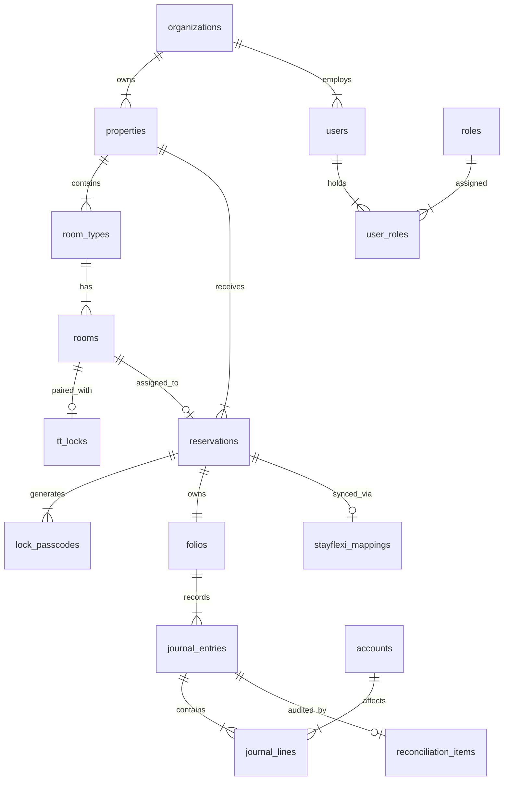

# Enterprise Multi-Hotel Operations Platform — Master Architecture Specification

## Document Control & Governance
- **Status**: Draft / Pending Phase 1 Approval
- **Author**: Principal Software Architect & Lead Staff Engineer
- **Target Stack**: Next.js 15, React 19, TypeScript, TailwindCSS, shadcn/ui, Hono, Drizzle ORM, PostgreSQL, Cloudflare Edge Infrastructure

---

## Table of Contents
1. [System Vision](#1-system-vision)
2. [Architecture Diagram](#2-architecture-diagram)
3. [Monorepo Structure](#3-monorepo-structure)
4. [Domain Driven Design (DDD)](#4-domain-driven-design)
5. [Bounded Contexts](#5-bounded-contexts)
6. [Entity Relationship Diagram (ERD)](#6-entity-relationship-diagram)
7. [Database Design](#7-database-design)
8. [Folder Structure](#8-folder-structure)
9. [API Design](#9-api-design)
10. [Authentication Architecture](#10-authentication-architecture)
11. [RBAC Model](#11-rbac-model)
12. [Multi-Tenant Strategy](#12-multi-tenant-strategy)
13. [Event-Driven Architecture](#13-event-driven-architecture)
14. [Integration Architecture (Stayflexi & TTLock)](#14-integration-architecture)
15. [Revenue Intelligence Architecture](#15-revenue-intelligence-architecture)
16. [Accounting Architecture](#16-accounting-architecture)
17. [Reconciliation Engine](#17-reconciliation-engine)
18. [Reporting Engine](#18-reporting-engine)
19. [Background Workers](#19-background-workers)
20. [Cloudflare Deployment Architecture](#20-cloudflare-deployment-architecture)
21. [Security Model](#21-security-model)
22. [Audit Logging](#22-audit-logging)
23. [Caching Strategy](#23-caching-strategy)
24. [Error Handling](#24-error-handling)
25. [Testing Strategy](#25-testing-strategy)
26. [Coding Standards](#26-coding-standards)
27. [Architecture Decision Records (ADRs)](#27-architecture-decision-records)
28. [Development Milestones](#28-development-milestones)
29. [Risk Matrix & Mitigation](#29-risk-matrix--mitigation)
30. [Future Expansion Plan](#30-future-expansion-plan)

---

## 1. System Vision

The **Enterprise Multi-Hotel Operations Platform** is a cloud-native, edge-first SaaS ecosystem designed to unified hotel chain operations, guest booking storefronts, automated IoT access control, channel management synchronization, revenue optimization, double-entry financial accounting, and automated daily reconciliation.

### Core Objectives
1. **Edge-First Global Storefront**: Instant page loads and booking flows served at Cloudflare edge locations worldwide via Next.js 15 App Router & Server Components.
2. **Sub-100ms API Latency**: High-performance backend API layer powered by Hono on Cloudflare Workers, connected to PostgreSQL via Cloudflare Hyperdrive / connection pooling.
3. **Flawless Financial Ledger**: Immutable double-entry bookkeeping engine with automated daily 3-way reconciliation (PMS vs Payment Gateways vs Bank Statements).
4. **Resilient Hardware & Channel Integrations**: Asynchronous, event-driven integration with Stayflexi PMS and TTLock IoT Smart Locks resilient against network partition and third-party downtime.
5. **AI-Ready Operational Foundation**: Structured domain events, standardized telemetry, and vector-compatible audit logging ready for autonomous guest concierge and dynamic yield management AI models.

---

## 2. Architecture Diagram

```mermaid
graph TD
    subgraph Clients ["Client Layer"]
        PublicStore ["Guest Storefront (Next.js 15)"]
        AdminWeb ["HQ / Hotel Staff Admin (Next.js 15)"]
        MobileWeb ["Housekeeping & Staff Web App"]
    end

    subgraph Edge ["Cloudflare Edge Platform"]
        Pages ["Cloudflare Pages (SSR & Static Assets)"]
        Worker ["Hono API Worker (Global Edge Router)"]
        KV ["Cloudflare KV (Session & Token Cache)"]
        Queue ["Cloudflare Queues (Async Event Bus)"]
        R2 ["Cloudflare R2 (Reports, Invoices, Attachments)"]
        Hyperdrive ["Cloudflare Hyperdrive (Postgres Pool)"]
    end

    subgraph Backend ["Core Domain Services (Cloudflare Workers)"]
        AuthSvc ["Auth & RBAC Context"]
        BookingSvc ["Booking & Inventory Domain"]
        LedgerSvc ["Double-Entry Accounting Domain"]
        ReconcileSvc ["Automated Reconciliation Engine"]
        RevenueSvc ["Revenue Intelligence Engine"]
        IntegrationSvc ["Integration Hub (Stayflexi & TTLock)"]
    end

    subgraph External ["External Third-Party APIs & IoT"]
        Stayflexi ["Stayflexi PMS API"]
        TTLock ["TTLock IoT Cloud Server"]
        Stripe ["Stripe / Payment Gateways"]
        Bank ["Bank Statement Feed / Open Banking"]
    end

    subgraph Storage ["Persistence Layer"]
        DB [(Primary PostgreSQL DB - Multi-Tenant RLS)]
    end

    Clients --> Pages
    Pages --> Worker
    Worker --> KV
    Worker --> AuthSvc
    Worker --> BookingSvc
    Worker --> LedgerSvc
    Worker --> IntegrationSvc
    Worker --> RevenueSvc

    AuthSvc & BookingSvc & LedgerSvc & ReconcileSvc --> Hyperdrive
    Hyperdrive --> DB

    IntegrationSvc <--> Stayflexi
    IntegrationSvc <--> TTLock
    BookingSvc <--> Stripe
    ReconcileSvc <--> Bank

    BookingSvc --> Queue
    IntegrationSvc --> Queue
    Queue --> ReconcileSvc
    Queue --> R2
```

---

## 3. Monorepo Structure

```
bookingengine/
├── .github/
│   └── workflows/
│       ├── ci.yml
│       └── deploy.yml
├── docs/
│   └── architecture/
│       └── ARCHITECTURE.md
├── apps/
│   ├── web-storefront/            # Next.js 15 Guest Storefront
│   │   ├── app/
│   │   ├── public/
│   │   ├── next.config.ts
│   │   └── package.json
│   ├── web-admin/                 # Next.js 15 Multi-Hotel Management Console
│   │   ├── app/
│   │   ├── components/
│   │   └── package.json
│   └── api-worker/                # Hono Backend API on Cloudflare Workers
│       ├── src/
│       │   ├── index.ts
│       │   ├── routes/
│       │   └── middlewares/
│       ├── wrangler.toml
│       └── package.json
├── packages/
│   ├── db/                        # Drizzle ORM Schema, Migrations, Database Client
│   │   ├── src/
│   │   │   ├── schema/
│   │   │   ├── client.ts
│   │   │   └── seed.ts
│   │   ├── drizzle.config.ts
│   │   └── package.json
│   ├── core/                      # Domain Entities, Pure Business Logic, Value Objects
│   │   ├── src/
│   │   │   ├── domain/
│   │   │   ├── value-objects/
│   │   │   └── errors/
│   │   └── package.json
│   ├── integrations/              # Stayflexi, TTLock, Stripe SDK Clients
│   │   ├── src/
│   │   │   ├── stayflexi/
│   │   │   ├── ttlock/
│   │   │   └── stripe/
│   │   └── package.json
│   ├── ui/                        # Shared Design System & shadcn Components
│   │   ├── src/
│   │   └── package.json
│   └── config/                    # Shared ESLint, TSConfig, Tailwind Configs
│       ├── typescript/
│       └── eslint/
├── package.json
├── pnpm-workspace.yaml
├── turbo.json
└── README.md
```

---

## 4. Domain Driven Design

We apply **Domain-Driven Design (DDD)** to strictly isolate domain invariants from infrastructure concerns.

### Strategic Distinctions
- **Ubiquitous Language**: Standardized terminology across code and business stakeholders (e.g., `Organization`, `Property`, `RoomCategory`, `Folio`, `JournalEntry`, `LockPasscode`, `Discrepancy`).
- **Core Domains**: Booking Engine, Inventory Control, Accounting Ledger, Daily Reconciliation.
- **Supporting Domains**: Guest Portal, Housekeeping Dispatch, Audit Logging.
- **Generic Domains**: Auth/RBAC, Notification Gateway, File Storage (R2).

---

## 5. Bounded Contexts

```mermaid
graph LR
    subgraph IAM ["Identity & Access Context"]
        User
        Role
        Permission
    end

    subgraph Property ["Property & Inventory Context"]
        Organization
        Property
        RoomType
        Room
    end

    subgraph Booking ["Reservation Context"]
        Reservation
        Guest
        RatePlan
    end

    subgraph Access ["Hardware & Access Context"]
        SmartLock
        Keycode
        AccessLog
    end

    subgraph Accounting ["Financial Ledger Context"]
        Account
        JournalEntry
        Folio
    end

    subgraph Integration ["Third-Party Sync Context"]
        PMSMapping
        WebhookLog
        SyncQueue
    end

    IAM --> Property
    Property --> Booking
    Booking --> Access
    Booking --> Accounting
    Booking --> Integration
```

### Context Isolation Summary
1. **Property & Inventory Context**: Tracks physical attributes, room status, maintenance, and category capacities.
2. **Reservation Context**: Owns room availability state, holds, pricing calculations, and guest bookings.
3. **Hardware & Access Context**: Manages TTLock device pairing, passcode provisioning, access windows, and battery health.
4. **Financial Ledger Context**: Implements immutable double-entry accounting records (`Debits = Credits`).
5. **Reconciliation Context**: Matches internal ledger entries against PMS reports and bank/gateway transaction files.
6. **Third-Party Sync Context**: Handles rate limits, webhooks, retries, and schema transformation for Stayflexi PMS.

---

## 6. Entity Relationship Diagram



---

## 7. Database Design

### Primary PostgreSQL Technology & Tenant Isolation
- **ORM**: Drizzle ORM (type-safe, zero-overhead SQL builder).
- **Driver**: `@neondatabase/serverless` or `pg` via Cloudflare Hyperdrive connection pooling.
- **Tenant Isolation**: Shared Database, Separate Schema / Row-Level Security (RLS) enforcing `organization_id` on every operational table.

### Core Schema Definitions (Drizzle Standard)

```typescript
// Shared columns snippet pattern:
// organization_id (UUID, NOT NULL, FK -> organizations.id)
// property_id (UUID, NULLABLE/NOT NULL, FK -> properties.id)
// created_at (TIMESTAMPTZ, DEFAULT NOW())
// updated_at (TIMESTAMPTZ, DEFAULT NOW())
// deleted_at (TIMESTAMPTZ, NULLABLE - Soft Delete)
```

#### Key Tables Overview
1. `organizations`: Top-level tenant context.
2. `properties`: Individual hotels/resorts under an organization.
3. `room_types`: Inventory definitions (e.g., Deluxe Ocean Suite).
4. `rooms`: Physical room inventory (e.g., Room 302).
5. `reservations`: Core booking entity with status (`pending`, `confirmed`, `checked_in`, `checked_out`, `cancelled`).
6. `folios`: Guest financial ledger account for a booking.
7. `accounts`: Chart of Accounts (Asset, Liability, Equity, Revenue, Expense).
8. `journal_entries`: Double-entry transaction headers.
9. `journal_lines`: Individual debit/credit lines (`sum(debit) == sum(credit)` enforced by DB trigger constraint).
10. `reconciliation_runs`: Daily reconciliation executions and status.
11. `reconciliation_discrepancies`: Unmatched or mismatch entries between systems.
12. `tt_locks` & `lock_passcodes`: Smart lock registry and active access credentials.
13. `stayflexi_sync_logs`: Audit history of PMS sync operations.

---

## 8. Folder Structure

### Backend API Architecture (`apps/api-worker/src`)
```
apps/api-worker/src/
├── index.ts                     # Hono Entrypoint & Middleware Setup
├── env.ts                       # Environment Variables Validation (Zod)
├── middlewares/
│   ├── auth.middleware.ts       # Auth & JWT Context
│   ├── tenant.middleware.ts     # Organization / Property Scope Resolution
│   ├── rbac.middleware.ts       # Permission Checks
│   └── error.middleware.ts      # Global Exception Handler
├── domains/
│   ├── auth/
│   │   ├── auth.router.ts
│   │   └── auth.service.ts
│   ├── properties/
│   ├── reservations/
│   ├── accounting/
│   ├── reconciliation/
│   ├── ttlock/
│   └── stayflexi/
└── shared/
    ├── utils/
    └── response.ts
```

---

## 9. API Design

### Hono RPC & OpenAPI Principles
- **Type-Safe RPC**: End-to-end type safety shared between Hono backend and Next.js frontend applications via `hono/client`.
- **RESTful Endpoints**: Predictable URL resource hierarchy with HTTP verbs (`GET`, `POST`, `PUT`, `PATCH`, `DELETE`).
- **Standardized Envelope Response**:

```json
{
  "success": true,
  "data": {},
  "error": null,
  "meta": {
    "timestamp": "2026-07-23T19:44:16Z",
    "requestId": "req_8f3a12b4"
  }
}
```

---

## 10. Authentication Architecture

- **Protocol**: JWT (JSON Web Token) with short expiry (15 min) + Refresh Tokens stored in httpOnly, Secure, SameSite=Strict cookies.
- **Edge Token Verification**: Standardized HMAC/RSA signature verification performed natively in Hono middleware using Web Crypto API.
- **Session Cache**: Cloudflare KV stores active session revocation lists for instant revocation capability.

---

## 11. RBAC Model

### Hierarchical Scopes
- `Organization`: Global administrative access across all properties.
- `Cluster`: Access to a regional group of hotels.
- `Property`: Access restricted to a single hotel.

### Standard Roles & Permissions
- `super_admin`: Full system control.
- `hotel_manager`: Full operational and financial control for assigned properties.
- `front_desk`: Check-in/check-out, reservation modification, passcode issuance.
- `housekeeper`: Room status update (`clean`, `dirty`, `inspect`).
- `accountant`: Financial ledger viewing, journal posting, daily reconciliation audit.

---

## 12. Multi-Tenant Strategy

- **Tenant Key**: `organization_id` (UUIDv4).
- **Enforcement Mechanism**:
  1. Every database query executed via Drizzle automatically appends `.where(eq(table.organizationId, tenantId))`.
  2. PostgreSQL Row Level Security (RLS) policies set `app.current_organization_id` on each connection check.

---

## 13. Event-Driven Architecture

### Cloudflare Queues & Event Bus
Domain events are published asynchronously to Cloudflare Queues to decouple processing:
- `reservation.created`: Triggers Stayflexi PMS sync, Stripe payment hold, TTLock passcode generation.
- `reservation.cancelled`: Revokes TTLock access passcode, processes refund, posts reversal journal entries.
- `reconciliation.triggered`: Runs daily matching pipeline asynchronously.

---

## 14. Integration Architecture

### Stayflexi PMS Sync
- **Mechanism**: Bidirectional sync via Webhooks & REST polling backup.
- **Resilience**: Outbox pattern with exponential backoff retries stored in PostgreSQL `stayflexi_sync_queue`.

### TTLock IoT Integration
- **Mechanism**: TTLock Cloud API v3 integration + Webhook receiver worker for real-time unlock logs.
- **Provisioning Flow**:
  1. Check-in event triggers `generatePasscode()` for target `room_id` during check-in window `[CheckInDate 14:00, CheckOutDate 11:00]`.
  2. Passcode dispatched via SMS/Email to guest and displayed in Guest Portal.

---

## 15. Revenue Intelligence Architecture

- **Rate Optimization**: Dynamic pricing engine calculating room rates based on:
  - Base Rate + Seasonality Multiplier + Occupancy Threshold Curve + Competitor Rate Benchmark.
- **Competitor Rate Ingestion**: Scheduled background cron worker fetching market rates.

---

## 16. Accounting Architecture

### Strict Double-Entry Ledger Invariants
1. Every financial transaction generates a `journal_entry` containing $\ge 2$ `journal_lines`.
2. $\sum \text{Debits} = \sum \text{Credits}$ must hold for every entry. If not equal, transaction is rejected by database trigger constraint.
3. Posted journal entries are immutable. Errors are corrected exclusively via compensating reversal entries.

---

## 17. Reconciliation Engine

### 3-Way Daily Automated Matching
- **Data Sources**:
  1. Internal Ledger (`journal_lines`)
  2. Stayflexi PMS Daily Revenue Report
  3. Payment Gateway (Stripe/Bank settlement CSVs)
- **Discrepancy Resolution**: Flagged automatically as `reconciliation_discrepancies` with classification (e.g., `FEE_MISMATCH`, `TIMING_DIFFERENCE`, `UNMATCHED_TRANSACTION`).

---

## 18. Reporting Engine

- **Real-Time Dashboards**: Aggregated metrics (RevPAR, ADR, Occupancy %, Daily Revenue) computed via optimized PostgreSQL materialized views & Cloudflare KV caching.
- **Large Report Export**: Asynchronous background generation streaming CSV/PDF files to Cloudflare R2 bucket with signed download URLs.

---

## 19. Background Workers

- **Cloudflare Cron Triggers**:
  - `0 * * * *` (Hourly): Sync room availability & retry failed webhooks.
  - `0 2 * * *` (Daily 02:00 AM): Run 3-way daily financial reconciliation.
  - `0 3 * * *` (Daily 03:00 AM): Expire outdated TTLock passcodes.

---

## 20. Cloudflare Deployment Architecture

- **Frontend Applications**: Deployed to Cloudflare Pages (App Router SSR & static asset distribution).
- **Backend API**: Deployed as Cloudflare Worker (`apps/api-worker`).
- **Database Connectivity**: Cloudflare Hyperdrive connection pooling providing sub-10ms connection setup to PostgreSQL.
- **Assets & Storage**: Cloudflare R2 for invoice PDF generation and static uploads.

---

## 21. Security Model

- **Zero Trust**: Edge validation of requests before reaching internal domain services.
- **PII Encryption**: Guest names, emails, and payment tokens encrypted at rest via AES-256-GCM.
- **CORS & Headers**: Strict Security Headers (HSTS, CSP, X-Frame-Options) configured at Cloudflare Worker edge middleware.

---

## 22. Audit Logging

- **Immutable Audit Trail**: `audit_logs` table tracking `who`, `what`, `when`, `where`, `ip_address`, `user_agent`, `old_state`, `new_state`.
- **Non-Repudiation**: Append-only log table with RLS prohibiting `UPDATE` or `DELETE` operations.

---

## 23. Caching Strategy

- **Edge KV Caching**: Static property details, room category specs, and rate plans cached in Cloudflare KV with `stale-while-revalidate` semantics.
- **Cache Invalidation**: Event-driven KV invalidation dispatches on property modification.

---

## 24. Error Handling

- **Result & AppError Pattern**: Standardized error class hierarchy with typed error codes (`NOT_FOUND`, `UNAUTHORIZED`, `INSUFFICIENT_INVENTORY`, `UNBALANCED_JOURNAL`).
- **Global Middleware Catch**: Unhandled exceptions caught, masked for security, logged to telemetry, and returned in standard JSON envelope.

---

## 25. Testing Strategy

- **Unit Testing**: Vitest for pure core domain logic, revenue pricing functions, and ledger math.
- **Integration Testing**: Local PostgreSQL test container running Drizzle migration and API endpoint tests via Hono test client.
- **E2E Testing**: Playwright suite testing full guest booking flow and staff admin dashboard.

---

## 26. Coding Standards

- **TypeScript**: `strict: true`, no `any`, explicit function return types required.
- **Drizzle**: Schema changes handled exclusively through migrations checked into monorepo source control.
- **Code Style**: ESLint + Prettier enforced pre-commit via Husky.

---

## 27. Architecture Decision Records

### ADR 001: Cloudflare Workers + Hono for Backend API
- **Context**: Need sub-100ms global response time and cost-effective serverless execution.
- **Decision**: Select Hono framework running on Cloudflare Workers edge runtime.
- **Consequences**: Fast cold starts (<5ms); requires Web Crypto & Cloudflare-compatible drivers (Neon/Hyperdrive).

### ADR 002: PostgreSQL + Drizzle ORM for Data Layer
- **Context**: Financial double-entry accounting requires strict ACID transactions and relational integrity.
- **Decision**: Choose PostgreSQL with Drizzle ORM over NoSQL.
- **Consequences**: Type-safe queries, strong relational guarantees, support for RLS multi-tenancy.

---

## 28. Development Milestones

- **Phase 0: Architecture & Foundation Setup** (Current)
- **Phase 1: Core Domain Models, DB Schema & Hono API Bootstrap**
- **Phase 2: Authentication, Multi-Tenant RBAC & Property Management**
- **Phase 3: Reservation Engine, Guest Storefront & Stripe Payment Integration**
- **Phase 4: Stayflexi PMS & TTLock Hardware Integration Hub**
- **Phase 5: Accounting Ledger, Daily Reconciliation Engine & Admin Dashboard**

---

## 29. Risk Matrix & Mitigation

| Risk | Impact | Likelihood | Mitigation Strategy |
| :--- | :--- | :--- | :--- |
| TTLock IoT Network Offline | High | Medium | Passcode offline cryptographic sync fallback via TTLock SDK algorithm |
| Stayflexi API Rate Limits / Outage | High | Medium | Asynchronous outbox pattern with exponential backoff & webhook replay |
| Ledger Imbalance | Critical | Low | Database-level trigger constraint enforcing `sum(debit) == sum(credit)` |

---

## 30. Future Expansion Plan

1. **AI Autonomous Concierge**: Vector embeddings in Cloudflare Vectorize for guest query answering and automated room service dispatch.
2. **Global Multi-Currency Ledger**: Dynamic exchange rate conversion engine for multi-national hotel groups.
3. **White-Label Storefront Builder**: Dynamic custom domain mapping via Cloudflare Custom Hostnames for hotel brands.
