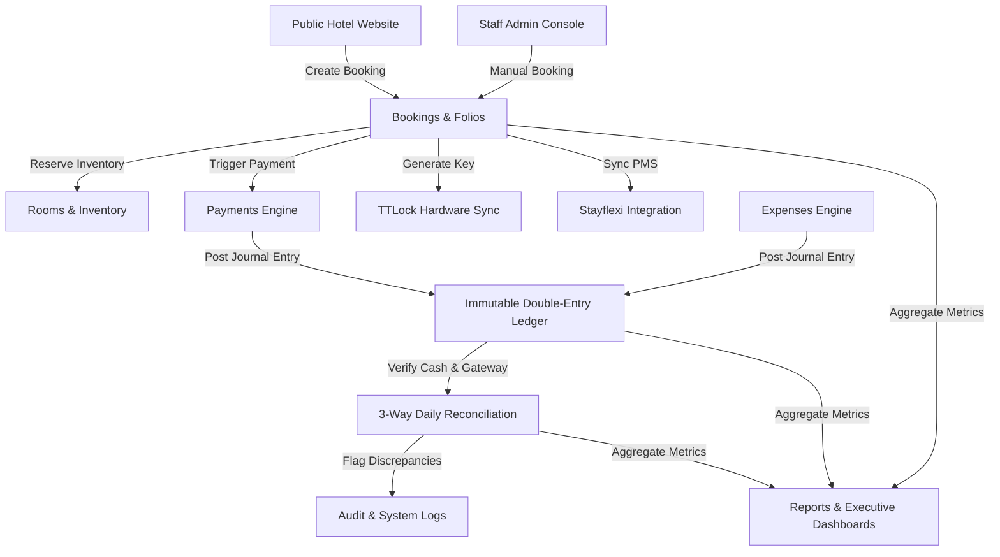
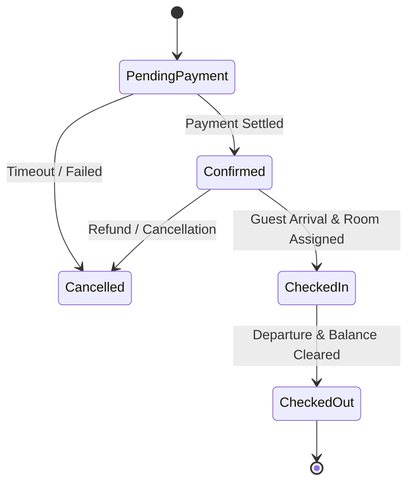

# Master Product Blueprint — Enterprise Multi-Hotel Operations Platform

## Document Metadata
- **Status**: Complete / Architecture Frozen
- **Target Repository**: `bookingengine` Monorepo
- **Primary References**: `docs/architecture/ARCHITECTURE.md`, `docs/ux/UX_ARCHITECTURE_SUMMARY.md`

---

## 1. Product Overview

### Vision
To provide a unified, edge-native SaaS platform empowering multi-hotel owners and management companies with real-time room availability, automated IoT smart lock provisioning, double-entry financial accounting, 3-way daily reconciliation, and AI-driven dynamic pricing.

### Mission
Eliminate operational friction, revenue leakage, and manual financial audit delays across independent and chain hotels by merging guest storefronts, property operations, and financial ledgers into a single event-driven ecosystem.

### Key Business Goals
1. **Zero Revenue Leakage**: 100% 3-way daily reconciliation between PMS, payment gateways, and bank feeds.
2. **Sub-100ms Booking Latency**: Edge storefront load and booking confirmation worldwide via Cloudflare Workers.
3. **Automated Keyless Check-in**: 100% offline-capable TTLock passcode issuance upon reservation confirmation.
4. **Audit Non-Repudiation**: Immutable double-entry financial ledger and cryptographically secure audit trail.

---

## 2. Product Modules

| Module Name | Purpose | Module Owner | Key Dependencies | Roadmap Focus |
| :--- | :--- | :--- | :--- | :--- |
| **Hotels & Properties** | Multi-hotel brand & property configuration | Property Domain | Core DB | Multi-brand white-labeling |
| **Rooms & Inventory** | Physical room status, categories, & capacity | Inventory Domain | Hotels | Maintenance workflow |
| **Guests** | Guest profiles, contact details, & history | CRM Domain | Core DB | Guest loyalty points |
| **Bookings & Folios** | Booking state machine, tape chart, & guest folios | Reservation Domain | Rooms, Guests, Rates | Group bookings |
| **Payments** | Payment gateway processing (Stripe, Cash, Terminal) | Financial Domain | Bookings, Folios | Multi-currency settlement |
| **Expenses** | Property operational expense logging & receipts | Accounting Domain | Hotels, Accounts | OCR receipt scanning |
| **Accounting Ledger** | Immutable double-entry journal postings | Accounting Domain | Payments, Expenses | Automated tax filings |
| **Daily Reconciliation** | 3-way automated matching (Ledger vs PMS vs Bank) | Audit Domain | Ledger, Payments | AI fuzzy reconciliation |
| **Revenue Intelligence** | Dynamic rate optimization & competitor benchmark | Revenue Domain | Bookings, Competitors | Automated AI rate publishing |
| **TTLock Hardware Sync** | IoT smart lock registry & passcode issuance | Access Domain | Bookings, Hardware | Bluetooth mobile key SDK |
| **Stayflexi PMS Sync** | Bidirectional inventory & booking channel sync | Integration Hub | Bookings, Rates | Multi-PMS adapter engine |
| **Reports & Dashboards** | Executive P&L, RevPAR, Occupancy, & export engine | Analytics Domain | All Modules | Real-time streaming reports |
| **Audit Logging** | Append-only non-repudiable system event log | Security Domain | Core Infra | Immutable R2 object lock |
| **Users & RBAC** | Scope-aware user accounts, roles, & permissions | IAM Domain | Core Infra | SSO & SAML2 integration |
| **Public Hotel Websites**| Guest storefront, room selection, & direct booking | Storefront Team | Bookings, Rates | White-label custom domains |

---

## 3. Module Interaction Diagram

---

## 4. Business Rules

1. **Unassigned Room Lock**: A reservation cannot be checked in without an assigned physical room.
2. **Double-Entry Financial Invariant**: Every financial transaction must create a journal entry with $\sum \text{Debits} = \sum \text{Credits}$. Unbalanced entries are rejected by database triggers.
3. **Closed Period Immutability**: Posted journal entries in a closed financial accounting period cannot be updated or deleted. Adjustments require explicit compensating reversal entries after period reopening approval.
4. **Rate Bounds**: Dynamic pricing algorithms can never adjust rates below the property `minimum_floor_rate` or above the `maximum_cap_rate`.
5. **Mandatory Audit Trail**: Every data mutation (`INSERT`, `UPDATE`, `DELETE`) automatically writes a record to the `audit_logs` table containing `user_id`, `organization_id`, `ip_address`, `previous_state`, and `new_state`.

---

## 5. Data Ownership Boundary

- `Bookings Module` owns reservation records, check-in/out dates, and guest folio charges.
- `Accounting Module` owns chart of accounts, journal entries, and trial balance calculations.
- `Payments Module` owns payment gateway transaction tokens, settlement batches, and refund logs.
- `Access Control Module` owns smart lock serials, battery health telemetry, and generated passcodes.
- `Revenue Intelligence Module` owns rate strategy rules, pricing recommendations, and competitor rate caches.

---

## 6. Cross-Module Events Catalogue

| Event Name | Publisher | Main Subscribers | Payload Summary |
| :--- | :--- | :--- | :--- |
| `reservation.created` | Bookings | Stayflexi, TTLock, Ledger | `{ reservationId, propertyId, guestId, amount }` |
| `payment.settled` | Payments | Ledger, Folios | `{ paymentId, folioId, amount, gatewayRef }` |
| `expense.approved` | Expenses | Ledger, Accounts Payable | `{ expenseId, propertyId, amount, category }` |
| `daily_closing.executed`| Reconciliation | Reports, Audit | `{ closingId, propertyId, date, status }` |
| `lock_code.generated` | TTLock Sync | Guest SMS/Email, Audit | `{ reservationId, lockId, passcode, expiresAt }` |

---

## 7. State Machines

### Reservation Lifecycle State Machine

---

## 8. Approval Matrix

| Action | Submitter | Required Approver | Escalation Path |
| :--- | :--- | :--- | :--- |
| **Expense $> \$500$** | Staff / Accountant | Hotel General Manager | Operations Director |
| **Manual Folio Refund $> \$250$** | Front Desk | Hotel General Manager | Owner |
| **Rate Override $> 20\%$** | Front Desk / Sales | Revenue Manager | Hotel General Manager |
| **Closed-Period Reopen** | Property Accountant | Chief Financial Officer | Owner |
| **User Role Change** | Hotel Manager | Super Admin / Owner | System Super Admin |

---

## 9. KPI Catalogue

- **ADR (Average Daily Rate)**: $\frac{\text{Total Room Revenue}}{\text{Total Rooms Sold}}$
- **RevPAR (Revenue Per Available Room)**: $\frac{\text{Total Room Revenue}}{\text{Total Available Rooms}}$
- **Occupancy %**: $\frac{\text{Total Rooms Occupied}}{\text{Total Rooms Available}} \times 100$
- **Net Operating Income (NOI)**: $\text{Gross Revenue} - \text{Total Operational Expenses}$
- **Reconciliation Match Rate %**: $\frac{\text{Matched Transactions}}{\text{Total Transactions}} \times 100$

---

## 10. Non-Functional Requirements

- **Performance**: Edge API response times $< 100\text{ms}$ globally (p95). Storefront initial load $< 1.2\text{s}$.
- **Availability**: 99.95% uptime powered by Cloudflare multi-region Workers & Pages.
- **Security**: AES-256 encryption at rest, TLS 1.3 in transit, strict RLS tenant isolation, OWASP top 10 compliance.
- **Compliance**: PCI-DSS tokenized payment processing via Stripe, GDPR guest data privacy deletion tools.

---

## 11. Vertical Slice Definition of Done

Every feature module MUST satisfy the 9-part checklist before code completion:
1. [x] PostgreSQL Drizzle Schema & Migration
2. [x] Hono API Worker Endpoints with Zod Payload Validation
3. [x] Business Invariants & Transaction Boundaries
4. [x] Scope-Aware RBAC Permission Guards (`hasPermission`)
5. [x] Append-Only Audit Logging (`audit_logs`)
6. [x] Next.js 15 UI Screens (`apps/admin` & `apps/website`)
7. [x] Sidebar Navigation Updates (`NAVIGATION_MATRIX.md`)
8. [x] Playwright E2E Integration Suite
9. [x] Documentation & Graphify Sync (`pnpm graph:update`)
