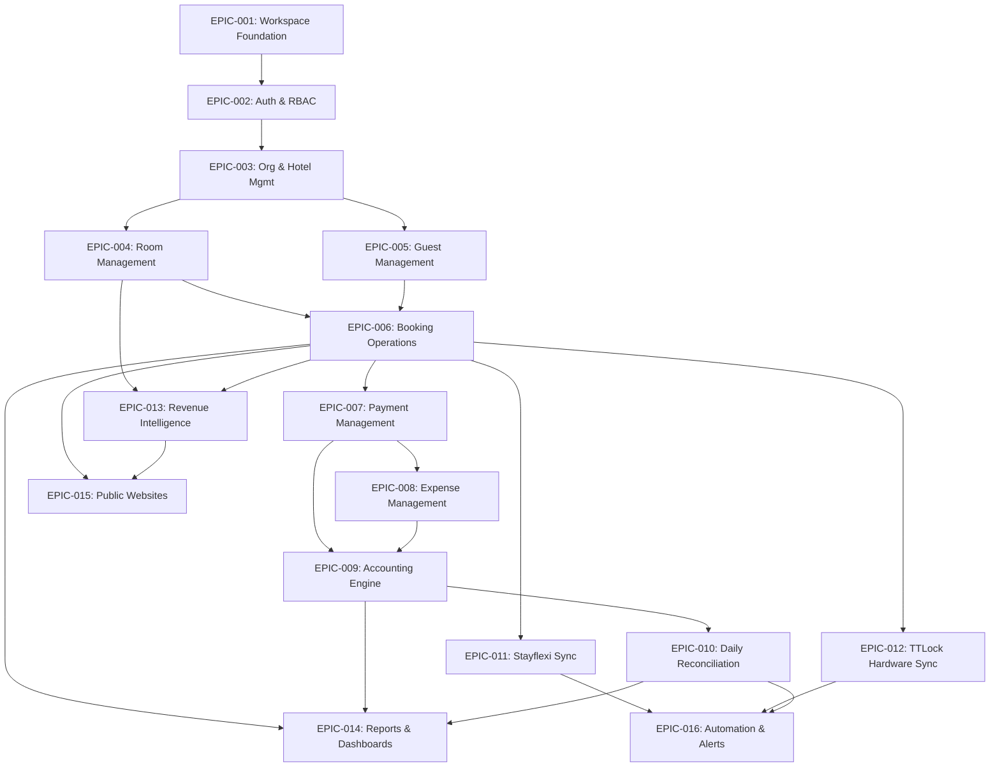

# Master Execution Plan & Epic Roadmap — Enterprise Multi-Hotel Operations Platform

## Document Metadata
- **Status**: Complete / Master Project Blueprint
- **Target Repository**: `bookingengine` Monorepo
- **Primary References**: `docs/architecture/ARCHITECTURE.md`, `docs/product/PRODUCT_BLUEPRINT.md`

---

## 1. Epic Catalogue & Module Ownership Boundaries

Each epic owns its domain boundaries. Cross-module data access MUST route through explicit domain services or published domain events. **Direct cross-module SQL joins or table reads are strictly prohibited.**

| Epic Key | Epic Name | Owning Boundary | Primary Deliverables |
| :--- | :--- | :--- | :--- |
| **EPIC-001** | **Workspace Foundation** | Monorepo & Tooling | pnpm workspace, TurboRepo, Next.js admin/website, Hono API `/health`, Drizzle setup, CI/CD, Git hooks. |
| **EPIC-002** | **Authentication & RBAC** | Identity & Access (IAM) | Session KV cache, short-lived JWT, httpOnly cookies, `hasPermission()` middleware, scope evaluator. |
| **EPIC-003** | **Organization & Multi-Hotel** | Property Domain | Organization & Hotel CRUD, Property configuration, Multi-tenant RLS policies. |
| **EPIC-004** | **Room Management** | Inventory Domain | Room categories, Room grid status matrix (`clean`, `dirty`, `maint`), Floor management. |
| **EPIC-005** | **Guest Management** | CRM Domain | Guest profiles, contact management, booking history, PII encryption. |
| **EPIC-006** | **Booking Operations** | Reservation Domain | Reservation state machine, Tape chart Gantt view, Room assignment, Folio creation. |
| **EPIC-007** | **Payment Management** | Financial Domain | Stripe gateway integration, Folio charge/refund processing, Payment settlement events. |
| **EPIC-008** | **Expense Management** | Accounting Domain | Property operational expense logging, Category tagging, Receipt attachment uploads (R2). |
| **EPIC-009** | **Accounting Engine** | Accounting Domain | Immutable double-entry ledger (`Debits = Credits`), Chart of Accounts, Journal posting engine. |
| **EPIC-010** | **Daily Reconciliation** | Audit Domain | 3-way automated matching (Ledger vs PMS vs Bank feeds), Fee tolerance, Discrepancy workspace. |
| **EPIC-011** | **Stayflexi Integration** | Integration Hub | Anti-Corruption Layer (ACL), Webhook receiver, Outbox queue worker, Channel inventory sync. |
| **EPIC-012** | **TTLock Hardware Sync** | Access Domain | Offline AES passcode generator, Smart lock registry, Door unlock log receiver. |
| **EPIC-013** | **Revenue Intelligence** | Revenue Domain | Dynamic rate pricing engine, Floor/Cap rate bounds, Competitor rate scraping background worker. |
| **EPIC-014** | **Reports & Dashboards** | Analytics Domain | Executive P&L dashboard, RevPAR/ADR/Occupancy KPIs, Async R2 streaming report exports. |
| **EPIC-015** | **Public Hotel Websites** | Storefront Domain | Guest direct booking engine, Room selection UI, Mobile-optimized reservation flow. |
| **EPIC-016** | **Automation & Notifications**| Infrastructure | Cloudflare Cron Triggers, Email/SMS passcode dispatches, Alert notifications. |

---

## 2. Epic Dependency Graph

---

## 3. Definition of Done per Epic

Every Epic MUST satisfy the 9-part vertical slice checklist before being marked complete:
1. **Database Schema**: Drizzle schema definitions & checked-in SQL migration.
2. **API Endpoints**: Hono API endpoints with Zod payload validation.
3. **Business Logic & Invariants**: Domain logic & transaction safety enforced.
4. **Scope-Aware RBAC**: `hasPermission()` guards (`<domain>:<resource>:<action>`).
5. **Audit Trail**: Every mutation writes to append-only `audit_logs` table.
6. **UI Screens**: Next.js 15 App Router pages using `@bookingengine/ui`.
7. **Navigation Updates**: Sidebar & quick actions updated per `NAVIGATION_MATRIX.md`.
8. **Automated Testing**: Unit tests (Vitest) & Playwright E2E suite.
9. **Documentation & Graphify Sync**: Graphify index updated (`pnpm graph:update`).

---

## 4. Git Strategy & Branch Governance

- **Main Branch Protection**: Direct commits to `main` prohibited. All changes arrive via Pull Requests (PRs).
- **Branch Naming**:
  - Epics/Features: `feature/<epic-id>-<short-description>` (e.g., `feature/epic-002-auth-rbac`)
  - Fixes: `fix/<issue-id>-<short-description>` (e.g., `fix/ledger-balance-rounding`)
- **Commit Message Format (Conventional Commits)**:
  - `feat(scope): add new feature`
  - `fix(scope): resolve bug`
  - `chore(scope): build or dependency updates`
  - `docs(scope): documentation updates`
- **Merge Strategy**: Squash and merge into `main` after CI status checks pass.

---

## 5. Sprint Execution Milestones

- **Sprint 1**: EPIC-001 (Workspace Foundation) & EPIC-002 (Auth & RBAC)
- **Sprint 2**: EPIC-003 (Org & Multi-Hotel Management)
- **Sprint 3**: EPIC-004 (Room Management) & EPIC-005 (Guest Management)
- **Sprint 4**: EPIC-006 (Booking Operations & Tape Chart)
- **Sprint 5**: EPIC-007 (Payment Management) & EPIC-008 (Expense Management)
- **Sprint 6**: EPIC-009 (Immutable Accounting Engine)
- **Sprint 7**: EPIC-010 (Daily 3-Way Reconciliation)
- **Sprint 8**: EPIC-011 (Stayflexi PMS Sync) & EPIC-012 (TTLock Hardware Sync)
- **Sprint 9**: EPIC-013 (Revenue Intelligence) & EPIC-014 (Reports & Dashboards)
- **Sprint 10**: EPIC-015 (Public Websites) & EPIC-016 (Automation & Alerts)

---

## 6. Risk Register

| Risk ID | Risk Description | Severity | Impact | Mitigation Strategy |
| :--- | :--- | :--- | :--- | :--- |
| **RISK-01** | Cross-tenant data leak via missing SQL filter | Critical | High | Mandatory PostgreSQL RLS policies setting `app.current_organization_id` on DB connection. |
| **RISK-02** | Ledger imbalance from concurrent postings | Critical | High | Append-only journal postings + DB-level trigger constraint enforcing $\sum \text{Debits} = \sum \text{Credits}$. |
| **RISK-03** | TTLock IoT offline lock gateway timeout | High | Medium | Local edge AES passcode generation algorithm requiring zero live network lock gateway call. |
| **RISK-04** | Stayflexi API rate limiting or webhooks lost | High | Medium | Cloudflare Queues event bus outbox pattern with exponential backoff & 24h deduplication. |

---

## 7. Epic Closure Review Checklist

Before marking any Epic as CLOSED:
- [x] `pnpm build` succeeds
- [x] `pnpm typecheck` succeeds (0 errors in strict mode)
- [x] `pnpm lint` succeeds (0 warnings)
- [x] Zero `any` types introduced
- [x] No unresolved `TODO` placeholders in codebase
- [x] `audit_logs` record posting implemented for all state mutations
- [x] `hasPermission()` RBAC guards active on all API routes & UI actions
- [x] `pnpm graph:update` executed & Graphify index verified
