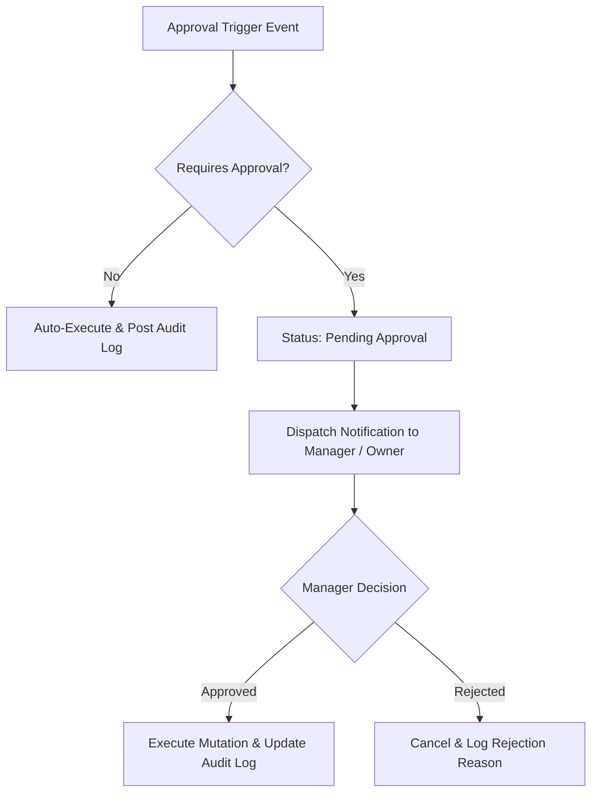

# Financial & Operational Approval Workflows

## Approval Chains Summary
1. **Financial Refund Approval**: Refunds $> \$250$ require GM approval; $> \$1,000$ require Owner approval.
2. **Rate Override Approval**: Manual rate reductions $> 20\%$ below base rate require Revenue Manager approval.
3. **Closed Financial Period Reopening**: Reopening closed accounting period requires Chief Accountant + Owner dual approval.
4. **Manual Journal Adjustment**: Manual ledger adjustments require Property Accountant submission + GM approval.
