# Information Architecture & Complete Sitemap

```mermaid
graph TD
    Root["/ (Admin App Base)"] --> Auth["/auth (Login, Refresh, MFA)"]
    Root --> Dash["/dashboard (Executive, Operations, Revenue)"]
    Root --> Res["/reservations (List, Detail, New, Tape Chart)"]
    Root --> Rooms["/rooms (Categories, Status Grid, Maintenance)"]
    Root --> Fin["/financials (Ledger, Accounts, Folios, AP/AR)"]
    Root --> Rec["/reconciliation (Daily Run, Discrepancies, Bank Feed)"]
    Root --> Rev["/revenue (Pricing Rules, Competitor Rates, Demand)"]
    Root --> Locks["/locks (Device Registry, Passcode Logs)"]
    Root --> Audit["/audit (System Activity Logs)"]
    Root --> Settings["/settings (Organization, Hotel, Users, Roles)"]
```

## Detailed URL Route Inventory

1. `/auth/login` - Staff Single Sign-On / Credential Login
2. `/dashboard/executive` - Owner & Director P&L and RevPAR KPIs
3. `/dashboard/operations` - GM Daily Operations Overview
4. `/reservations` - Filterable Reservation List View
5. `/reservations/grid` - Visual Room Tape Chart
6. `/reservations/[id]` - Reservation Details, Folio Charges, & Guest Details
7. `/rooms/status` - Live Room Cleaning & Maintenance Matrix
8. `/locks/issuance` - Smart Lock Access Passcode Generator
9. `/financials/ledger` - Immutable Double-Entry Journal Postings
10. `/financials/chart-of-accounts` - Chart of Accounts Management
11. `/reconciliation/daily-run` - 3-Way Reconciliation Execution Screen
12. `/reconciliation/discrepancies` - Discrepancy Resolution Workspace
13. `/revenue/dynamic-rates` - Rate Optimization Strategy Panel
14. `/audit/logs` - Non-Repudiable Audit Log Viewer
15. `/settings/users-roles` - Scope-Aware RBAC User Management
