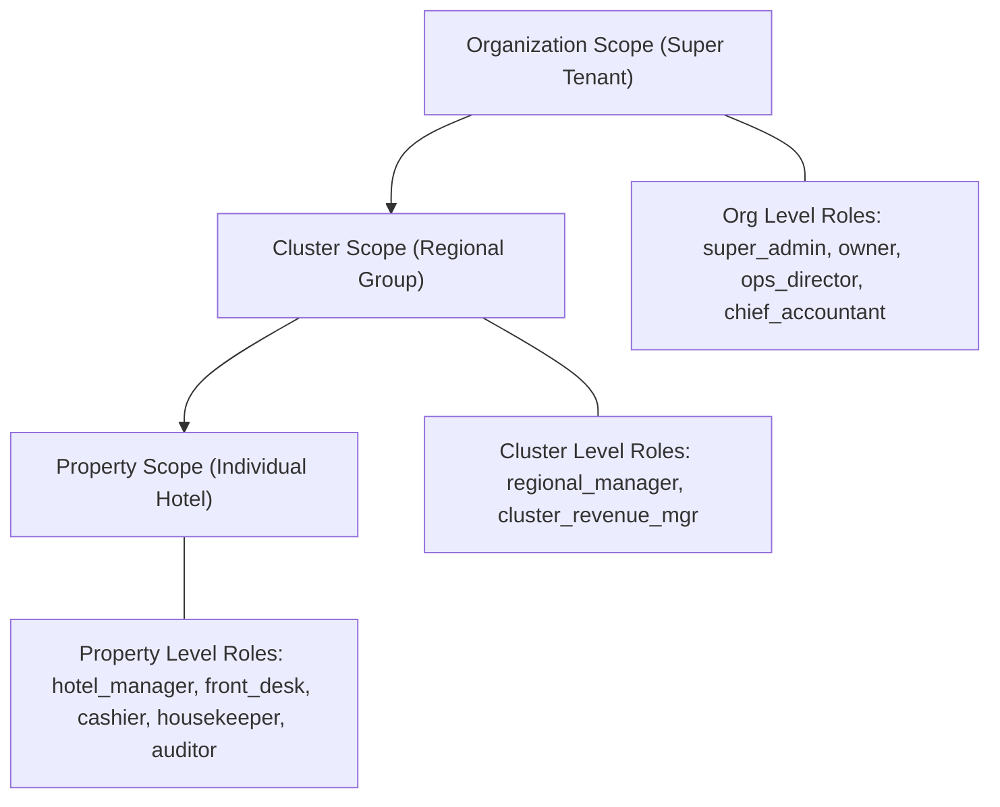

# Role Hierarchy & Organizational Access Model

## 1. Executive Summary
The platform enforces a scope-aware, permission-based Role-Based Access Control (RBAC) hierarchy. Access is granted across three organizational scopes: **Organization (Tenant)**, **Cluster (Region)**, and **Property (Hotel)**.

---

## 2. Organizational Scopes



---

## 3. Standard System Roles

| Role Key | Name | Target Scope | Description |
| :--- | :--- | :--- | :--- |
| `super_admin` | Platform Super Admin | Global System | Full administrative access to system infrastructure and organizations. |
| `owner` | Multi-Hotel Owner | Organization | Strategic owner view across all properties, executive financials, & P&L. |
| `ops_director` | Operations Director | Organization | Operations oversight, staff allocation, rate overrides, audit logs. |
| `chief_accountant` | Chief Financial Officer | Organization | Ledger oversight, chart of accounts, closed-period reopening approvals. |
| `cluster_mgr` | Regional Cluster Manager | Cluster | Multi-property management for assigned geographic cluster. |
| `revenue_mgr` | Revenue Manager | Cluster / Property | Dynamic pricing strategies, competitor benchmark analysis, rate publishing. |
| `hotel_manager` | General Manager | Property | Full operational and financial responsibility for a single hotel. |
| `front_desk` | Front Desk Agent | Property | Check-in, check-out, room assignment, lock code generation, folio updates. |
| `cashier` | Cashier / Billing Agent | Property | Payment collection, cash book entries, receipt generation, guest checkout. |
| `accountant` | Property Accountant | Property | Daily journal postings, bank reconciliation matching, expense entries. |
| `housekeeper` | Housekeeping Staff | Property | Real-time room status updates (`dirty`, `cleaning`, `inspected`). |
| `auditor` | Night Auditor | Property | End-of-day audit, revenue verification, ledger balance validation. |

---

## 4. Hotel Assignment & Context Resolution
- Users can hold multiple roles across different properties (e.g., `hotel_manager` at Hotel A and `auditor` at Hotel B).
- The active session JWT encapsulates:
  ```json
  {
    "sub": "user_8f12a3b4",
    "org_id": "org_1111-2222",
    "scopes": [
      { "role": "hotel_manager", "property_id": "prop_hotel_a" },
      { "role": "auditor", "property_id": "prop_hotel_b" }
    ]
  }
  ```
