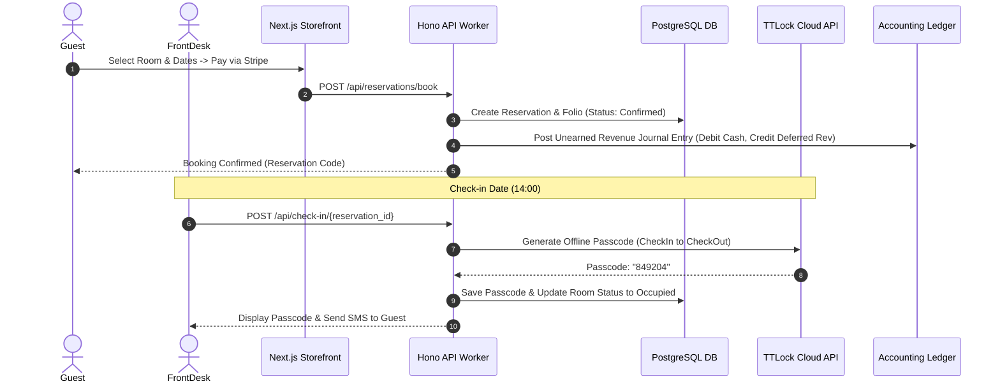

# End-to-End User Workflows

## Core Workflows Catalog
1. **Guest Online Booking**: Search -> Rate Select -> Stripe Payment -> Folio Creation -> Deferred Revenue Posting.
2. **Walk-in Booking & Instant Check-in**: Front Desk Form -> Card Swipe / Cash -> Instant Lock Passcode Generation.
3. **Daily Financial Closing & 3-Way Reconciliation**: Night Auditor triggers closing -> Reconcile Svc compares PMS vs Gateway vs Bank -> Flags discrepancies.
4. **TTLock Emergency Passcode Issue**: Staff selects room -> Edge Worker generates AES-key passcode offline -> Transmitted to guest phone.
5. **Closed-Period Financial Reopening**: Accountant requests reopen -> Chief Accountant / Owner receives approval task -> Audit log records justification.
