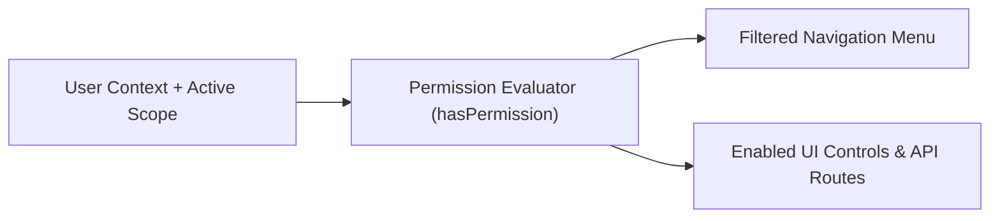

# UX & Access Control Architecture — Master Summary

## 1. System Scale Metrics
- **Total Screen Count**: 15 Core Admin Screens + 4 Guest Storefront Screens = **19 Primary Screens**
- **Reusable UI Component Count**: **10 Standardized Domain Components** (`DataTable`, `MoneyInput`, `StatusBadge`, `PasscodeWidget`, `LedgerEntryRow`, `AuditTimeline`, `RoomStatusCard`, `KPIStatWidget`, `ApprovalDialog`, `DateRangePicker`)
- **System Roles**: **12 Standard Roles** (`super_admin`, `owner`, `ops_director`, `chief_accountant`, `cluster_mgr`, `revenue_mgr`, `hotel_manager`, `front_desk`, `cashier`, `accountant`, `housekeeper`, `auditor`)
- **Fine-Grained Permissions**: **28 Discrete Permissions** (`property:*`, `booking:*`, `iot:*`, `ledger:*`, `reconcile:*`, `revenue:*`, `audit:*`, `system:*`)

---

## 2. Navigation & Scope Resolution Architecture
All UI screens check permission tokens at the edge (`hono/client` + `hasPermission()` middleware) before rendering controls or making backend API calls.

---

## 3. Future Extensibility Recommendations
1. **Dynamic Custom Role Builder**: Store permission sets in database tables allowing organization owners to assemble custom staff roles.
2. **Multi-Brand White-Label Design System**: CSS variable theme switching supporting distinct brand colors and typography per hotel collection.
3. **AI Concierge Action Overlay**: Mobile & web floating drawer widget executing guest service requests.
